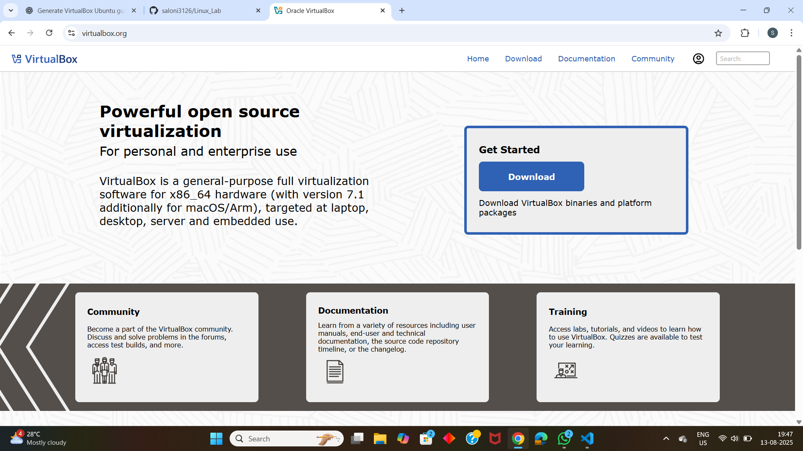

#  VirtualBox and Ubuntu Installation Guide

This guide walks you through the steps to download and install **Oracle VirtualBox** and **Ubuntu** on your system.

---

## Prerequisites

- A computer with internet access
- Minimum 20GB free disk space
- Minimum 4GB RAM (8GB recommended)

---

## 1️ Download and Install VirtualBox

###  Step 1: Go to the VirtualBox website

[https://www.virtualbox.org](https://www.virtualbox.org)

###  Step 2: Download VirtualBox for your OS

Choose the correct platform package:

- **Windows hosts**
- **macOS hosts**
- **Linux distributions**

Example:  
If you're on Windows, click on **"Windows hosts"** to download the `.exe` installer.

###  Step 3: Install VirtualBox

- Run the downloaded installer
- Follow the on-screen instructions
- Use default settings unless you have specific preferences
- Complete the installation

---

## 2️ Download Ubuntu ISO

###  Step 1: Go to the Ubuntu download page

[https://ubuntu.com/download/desktop](https://ubuntu.com/download/desktop)

###  Step 2: Choose the Ubuntu version

The latest LTS (Long Term Support) version is recommended (e.g., **Ubuntu 24.04 LTS**)

- Click **Download**

This will download an `.iso` file (~4.5 GB)

---

## 3️ Create a New Virtual Machine

###  Step 1: Launch VirtualBox and click "New"

- Name: `Ubuntu`
- Type: `Linux`
- Version: `Ubuntu (64-bit)`

###  Step 2: Assign Memory (RAM)

- Recommended: **4096 MB** (4GB) or more

###  Step 3: Create a Virtual Hard Disk

- Choose "Create a virtual hard disk now"
- VDI (VirtualBox Disk Image)
- Dynamically allocated
- Size: At least **25 GB**

---

## 4️ Load Ubuntu ISO

###  Step 1: Select the VM and click **Settings**

- Go to **Storage**
- Under "Controller: IDE", click the empty disc icon
- On the right, click the disc icon > "Choose a disk file..."
- Select the Ubuntu `.iso` file you downloaded

###  Step 2: Start the VM

- Click **Start**
- The Ubuntu installer will launch

---

## 5️ Install Ubuntu

- Choose language and keyboard layout
- Choose **"Install Ubuntu"**
- Select installation type: "Erase disk and install Ubuntu" (only applies inside VM)
- Follow prompts to create user, password, etc.
- Wait for installation to finish
- Restart the VM when prompted

---

##  Done!

You now have Ubuntu running inside VirtualBox. 🎉  
Start exploring the Linux environment!

---

##  Tips

- You can install **Guest Additions** from the VirtualBox menu for better performance and screen resizing.

