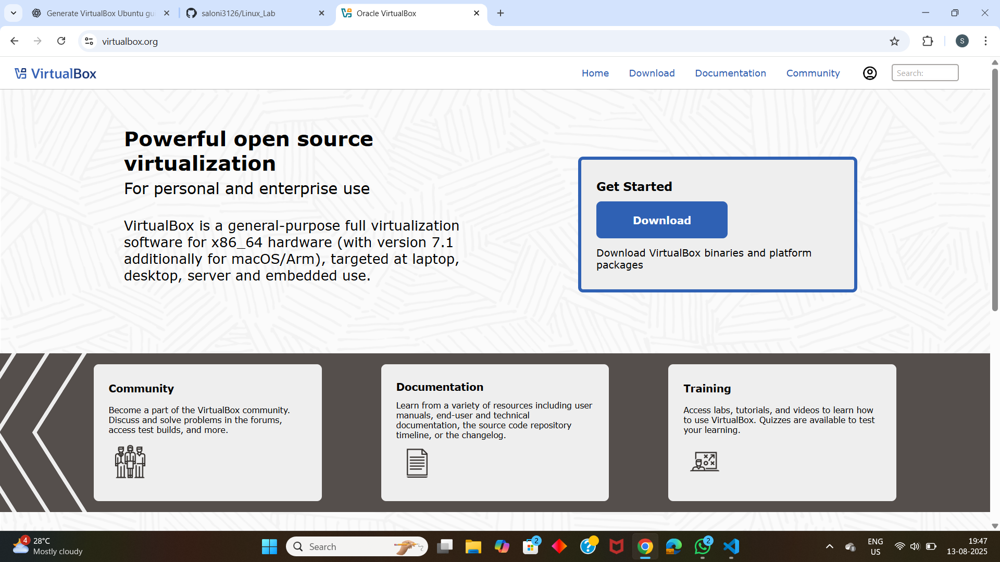
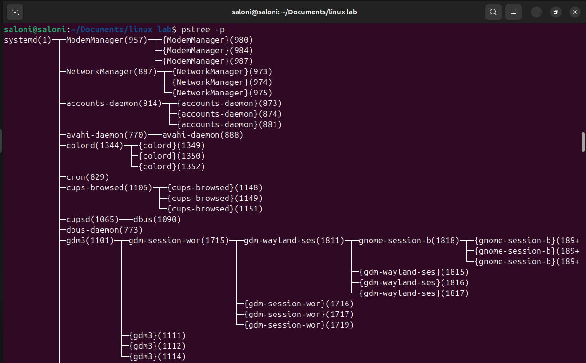
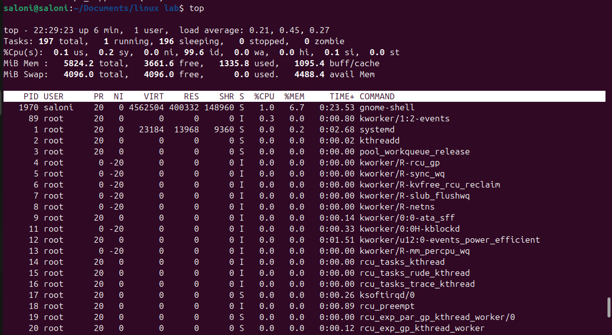
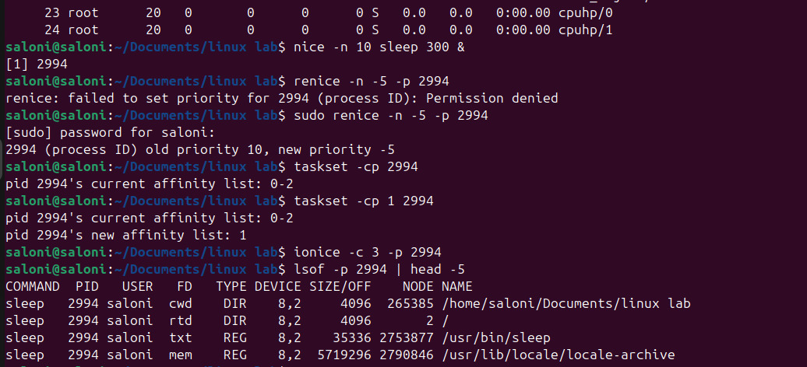
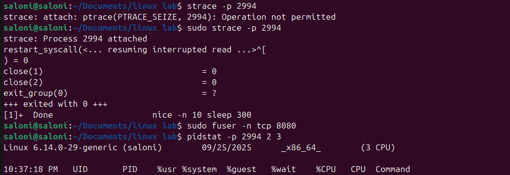

# Linux Process Management – Comprehensive Assignment

Linux is a multi-user, multitasking operating system that allows multiple processes to run simultaneously.  
**Process management** is one of the most essential aspects of Linux administration, enabling users to monitor, control, and optimize system performance.

This document provides a detailed exploration of **Linux process management** using essential system commands and tools.

---

## 1. Viewing All Processes

### command

```bash
pa aux
```

---

### description

the ````ps``` command (short for process status) provides information about active processes.
The options used here:

* a – Displays processes from all users (not just your own).

* u – Shows the user/owner and detailed information like CPU and memory usage.

* x – Lists processes not attached to a terminal (like daemons and background tasks).

---

### example output

```bash
USER       PID  %CPU %MEM    VSZ   RSS TTY      STAT START   TIME COMMAND
root         1  0.0  0.1 167500  1100 ?        Ss   Sep25   0:05 /sbin/init
vibhu     1234  1.2  1.5 274532 15632 ?        Sl   10:15   0:12 /usr/bin/python3 script.py
mysql     2001  0.5  2.0 450000 20988 ?        Ssl  Sep25   1:02 /usr/sbin/mysqld
```

---

### Key Concepts

PID (Process ID): Unique number identifying each running process.

STAT: Process state (e.g., S = sleeping, R = running, Z = zombie).

VSZ/RSS: Virtual and resident memory sizes used by the process.

**Usage Example:**
To find all processes of a particular user:

```bash
ps -u saloni
```



---

## 2.Viewing the Process Tree

### Command

```bash
pstree -p
```

---

## Description

The pstree command visually represents running processes in a tree structure, showing parent-child relationships.
**example output:**

```bash
systemd(1)─┬─NetworkManager(778)
           ├─sshd(895)─┬─sshd(1023)───bash(1024)───pstree(1101)
           ├─mysqld(2001)
           └─python3(1234)
```

---

### KeyConcepts

Every process in Linux (except the first one, usually init or systemd) is spawned by another process.

Helps identify which processes were started by which parent — useful for debugging and service dependency tracing.

---


---

## 3. Real-Time Process Monitoring

### Command

```bash
top
```

---

### Description

The `top` command provides a **real-time view** of system performance, including CPU, memory, and process activity.
It updates dynamically and allows sorting by various fields (like `%CPU` or `%MEM`).

### Example Output (partial)

```bash
top - 10:20:51 up 2 days,  3:12,  2 users,  load average: 0.22, 0.33, 0.45
Tasks: 197 total,   1 running, 196 sleeping,   0 stopped,   0 zombie
%Cpu(s): 12.3 us,  5.4 sy,  0.0 ni, 80.1 id,  2.2 wa,  0.0 hi,  0.0 si,  0.0 st
PID   USER      PR  NI    VIRT    RES    SHR S  %CPU %MEM     TIME+ COMMAND
1234  vibhu     20   0  274532  15632   7892 R   45.0  1.5   0:12.34 python3
2001  mysql     20   0  450000  20988   7564 S   25.0  2.0   1:02.11 mysqld
```

---

### Key Concepts

* **load average:** Represents system load over the past 1, 5, and 15 minutes.
* **%CPU / %MEM:** Show per-process usage.
* **S (state):** `R` = running, `S` = sleeping, `Z` = zombie, `D` = uninterruptible sleep.

**Tips:**

* Press `q` → Quit
* Press `k` → Kill a process
* Press `M` → Sort by memory usage
* Press `P` → Sort by CPU usage

---



---

## 4. Adjusting Process Priority

### Start a Process with Low Priority

```bash
nice -n 10 sleep 300 &
```

**Output:**

```bash
[1] 3050
```

The `nice` command starts a process with a specified **“niceness” value** — how kind it is to other processes when competing for CPU.

* Range: `-20` (highest priority) to `19` (lowest priority)
* Default: `0`

### Change Priority of a Running Process

```bash
renice -n -5 -p 3050
```

**Output:**

```bash
3050 (process ID) old priority 10, new priority -5
```

 A **negative nice value** increases priority (requires superuser).

**Usage Example:**

```bash
sudo renice -n -10 -p $(pgrep mysqld)
```

---


---

## 5. CPU Affinity (Binding Processes to CPU Cores)

### Command

```bash
taskset -cp 3050
```

**Output:**

```bash
pid 3050's current affinity list: 0-3
```

### Restrict to Core 1 Only

```bash
taskset -cp 1 3050
```

**Output:**

```bash
pid 3050's current affinity list: 1
```

### Explanation

CPU affinity determines **which CPU cores** a process is allowed to run on.
Binding specific processes to specific cores can optimize performance for CPU-intensive workloads or isolate processes to reduce interference.

---

## 6. I/O Scheduling Priority

### Command

```bash
ionice -c 3 -p 3050
```

**Output:**

successfully set pid 3050's IO scheduling class to idle

### Description

The `ionice` command controls a process’s **I/O scheduling class and priority** — how it competes for disk access.

**Classes:**

* `1` → Real-time (highest priority)
* `2` → Best-effort (default)
* `3` → Idle (only when system is not busy)

---

## 7. File Descriptors Used by a Process

### Command

```bash
lsof -p 3050 | head -5
```

**Output:**

```bash

COMMAND  PID USER   FD   TYPE DEVICE SIZE/OFF   NODE NAME
sleep   3050 vibhu  cwd  DIR  253,0     4096  131073 /home/vibhu
sleep   3050 vibhu  rtd  DIR  253,0     4096       2 /
sleep   3050 vibhu  txt  REG  253,0    17520  133580 /usr/bin/sleep

```

**Explanation:**
Each open file, socket, or pipe in Linux is represented by a **file descriptor (FD)**.
`lsof` (List Open Files) helps identify what files a process has open, aiding in debugging and security analysis.

---

## 8. Trace System Calls of a Process

### Command

bash
strace -p 3050

**Output:**

```bash
strace: Process 3050 attached
restart_syscall(<... resuming interrupted nanosleep ...>) = 0
nanosleep({tv_sec=300, tv_nsec=0}, 0x7ffd4a60d8b0) = ? ERESTART_RESTARTBLOCK (Interrupted by signal)
```

**Description:**
`strace` traces all system calls made by a process — useful for debugging errors, performance bottlenecks, or understanding program behavior.

---


---

## 9. Find Process Using a Specific Port

### Command

```bash
sudo fuser -n tcp 8080
```

**Output:**

```bash

8080/tcp:           4321
```

**Explanation:**
`fuser` identifies processes using a particular port or file.
This is essential for diagnosing port conflicts in web servers or network applications.

---

## 10. Per-Process Statistics

### command

```bash
pidstat -p 3050 2 3
```

**Output:**

```bash
Linux 5.15.0 (ubuntu)   09/25/25        x86_64        (4 CPU)
12:30:20      UID       PID    %usr %system  %CPU   CPU  Command
12:30:22     1000      3050    0.00    0.00   0.00     1  sleep
12:30:24     1000      3050    0.00    0.00   0.00     1  sleep
12:30:26     1000      3050    0.00    0.00   0.00     1  sleep
```

**Description:**
`pidstat` (from the `sysstat` package) provides periodic statistics for processes, such as CPU and memory usage.
The above command reports data **every 2 seconds**, **3 times**.

---

## 11. Control Groups (cgroups) for Resource Limits

Control Groups (cgroups) allow fine-grained **resource allocation** for groups of processes.

### Create a New cgroup

```bash
sudo cgcreate -g cpu,memory:/testgroup
```

### Limit CPU and Memory Usage

```bash
echo 50000 | sudo tee /sys/fs/cgroup/cpu/testgroup/cpu.cfs_quota_us
echo 100M   | sudo tee /sys/fs/cgroup/memory/testgroup/memory.limit_in_bytes
```

### Add a Process (PID 3050) to the Group

bash
echo 3050 | sudo tee /sys/fs/cgroup/cpu/testgroup/cgroup.procs

**Explanation:**

* **cpu.cfs_quota_us** controls how much CPU time processes in the group can use.
* **memory.limit_in_bytes** restricts the group’s total memory usage.

This mechanism prevents runaway processes from overloading the system.

---

## 12. Alternatives to `nice` / `renice`

| **Tool**        | **Description**                                           | **Example Usage**                                     |
| :-------------- | :-------------------------------------------------------- | :---------------------------------------------------- |
| **chrt**        | Sets real-time scheduling policies (FIFO or Round Robin). | `sudo chrt -f 50 sleep 1000`                          |
| **ionice**      | Adjusts I/O priority class and level.                     | `ionice -c 2 -n 7 tar -czf backup.tar.gz /home`       |
| **taskset**     | Sets CPU affinity for a process.                          | `taskset -c 1 firefox`                                |
| **cgroups**     | Manages CPU/memory quotas and priorities.                 | (see section 11)                                      |
| **systemd-run** | Runs a process under systemd with cgroup limits.          | `systemd-run --scope -p CPUWeight=200 stress --cpu 4` |
| **schedtool**   | Custom scheduling policy tool.                            | `sudo schedtool -R -p 10 <pid>`                       |

---

## Summary Table

| **Tool**      | **Focus Area**                    | **Alternative To**     |
| :------------ | :-------------------------------- | :--------------------- |
| `chrt`        | Real-time scheduling              | `nice`                 |
| `ionice`      | I/O scheduling                    | Complementary          |
| `taskset`     | CPU core binding                  | Complementary          |
| `cgroups`     | Resource management               | `nice` (more advanced) |
| `systemd-run` | systemd + cgroup resource control | `nice`                 |
| `schedtool`   | Custom scheduling                 | `nice`                 |

---

## Concept Recap

* **Process:** A running instance of a program.
* **PID:** Unique identifier assigned to each process.
* **Parent–Child Hierarchy:** Every process is created by another.
* **Nice Value:** Adjusts process CPU scheduling priority.
* **Affinity:** Binds process execution to specific CPUs.
* **I/O Priority:** Manages disk read/write scheduling.
* **cgroups:** Limit and monitor CPU/memory resources.

---

## Practical Tips

* View top memory users:

  ```bash
  ps -eo pid,ppid,cmd,%mem,%cpu --sort=-%mem | head
  ```

* Interactive monitoring with colors and tree view:

  ```bash
  htop
  ```

* Graceful process termination:

  ```bash
  kill -15 <pid>  # graceful
  kill -9 <pid>   # forceful
  ```

* Check cgroup statistics:

  ```bash
  cat /sys/fs/cgroup/cpu/testgroup/cpu.stat
  ```

---

## References

* `man ps`, `man top`, `man taskset`, `man ionice`
* [Linux man pages](https://man7.org/linux/man-pages/)
* [Red Hat Performance Tuning Guide](https://access.redhat.com/documentation/en-us/red_hat_enterprise_linux/)

---
